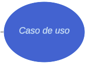

# Casos de Uso

## Introdução

## Metodologia

Tabela 1 - Elementos do diagrama de casos de uso.

| Símbolo | Nome | Descrição |
|:-:|:-:|:-|
|  | Atores | 
Atores representam algo ou alguém que utiliza o sistema para atingir um objetivo, podendo ser uma pessoa, organização, outro sistema ou dispositivo externo. Atores são objetos externos, que serão representados fora dos limites do projeto. Os atores também podem ser dividos em atores primários e secundários, os primários são aqueles que iniciam a utilização do sistema, que são representados do lado esquerdo do diagrama, e os secundários são os atores que reagem a uma certa ação, representados do lado direito do diagrama.
 |
|  | Casos de Uso | 
Representa uma ação que realiza uma tarefa dentro do sistema, são representados dentro do retângulo do sistema pois são funcionalidades realizadas pelo projeto que está sendo implementado.
 |
|  | Sistema | 
Projeto que está sendo desenvolvido. O retângulo que abrange o sistema representa os limites do projeto, o que ele deve realizar, separando os casos de uso, que podem ficar dentro do sistema, dos atores, que devem ficar do lado de fora do retângulo.
 |
|  | Relacionamentos | 
São interações que acontecem entre os atores com os casos de uso ou entre os próprios casos de uso. 
 |

Fonte: [Ricardo Augusto][RicardoGH], 2024.

Existem alguns tipos de relacionamento: 

- Associação: indica que existe uma comunicação ou interação simples entre os dois elementos do relacionamento. É representada por uma linha simples.
- Inclusão: indica uma dependência entre um caso de uso base para um caso de uso incluído, indica que um caso de uso base só irá ocorrer quando esse caso de uso incluído for finalizado. É representado por uma seta tracejada que aponta do caso base para o caso de uso incluído; 
- Extensão: indica que um caso de uso estendido será realizado somente algumas vezes em que um caso de uso base for realizado, só irá ocorrer quando alguns critérios forem cumpridos. É representado por uma seta tracejada apontando do caso estendido para o caso de uso base;
- Generalização (ou herança): indica uma hierarquia entre os casos de uso. Isso significa que um caso de uso especializado (secundário) herda comportamentos e características de um caso de uso geral (primário), mas também cada caso de uso secundário acrescenta algo novo ao caso de uso. É representado por uma seta simples, apontado do caso de uso secundário para o primário.

## Diagrama de Casos de Uso

## Especificação dos casos de uso

Modelo:

Tabela 2 - Modelo de especificação de caso de uso.

| UCxx | Nome do caso de uso |
|-|-|
| **Descrição** | 
Uma breve explicação do que o caso de uso faz ou descreve.
 |
| **Atores** | 
Os papéis ou entidades que interagem com o sistema.
 |
| **Pré-condição** | 
 As condições que devem ser verdadeiras antes que o caso de uso possa ser iniciado.
 |
| **Pós-condição** | 
As condições que devem ser verdadeiras após a conclusão bem-sucedida do caso de uso.
 |
| **Fluxo principal** | 
A sequência de passos que descreve a interação típica entre o ator e o sistema para atingir o objetivo do caso de uso.
 |
| **Fluxo alternativo** | 
Sequências de passos que ocorrem se condições específicas forem atendidas durante a execução do caso de uso, mas não são necessariamente o caminho principal.
 |
| **Fluxo de exceções** | 
Sequências de passos que descrevem como lidar com erros ou situações inesperadas durante a execução do caso de uso.
 |

Fonte: [Ricardo][RicardoGH], 2024.

### 1. Calcular preços e prazos de entrega

### 2. Realizar compras na loja online

**Tabela 4 - Realizar Compras na Loja Online.**

| UC02 | Nome do caso de uso |
|-|-|
| **Descrição** | 
Neste caso de uso é possível realizar compras de diversos itens na loja online.
 |
| **Atores** | 
Usuário
 |
| **Pré-condição** | 
 1. É necessário que o usuário acesse a página da loja online dos correios e esteja logado. 
 |
| **Pós-condição** | 
O usuário realiza uma compra na loja online.
 |
| **Fluxo principal** | 
1.O usuário navega até a opção compras e logo em seguida loja online.  2. O usuário realiza o seu cadastro/login. 3.O usuário escolhe um ou mais produtos clicando neles e prosseguindo através da opção "Comprar".  4. O usuário edita a quantidade de itens antes de fechar a compra.<5. O usuário insere o CEP ou edita ele.>  6. O usuário prossegue para a etapa de pagamento clicando em fechar pedido.   7.O Usuário escolhe a forma de pagamento e finaliza a compra.  
 |
| **Fluxo alternativo** |  |
| **Fluxo de exceções** |  |

Fonte: [Elias F. Oliveira][EliasGH], 2024.

### 3. Emitir certificados digitais

### 4. Realizar pré-postagem

### 5. Gerenciar minhas importações

### 6. Rastrear encomendas

Tabela 8 - Rastrear encomendas.

| UC06 | Rastrear Encomendas |
|-|-|
| **Descrição** | 
Este caso de uso permite que os usuários do site dos correios rastreiem suas encomendas inserindo o número de rastreamento fornecido.
 |
| **Atores** | 
Usuário
 |
| **Pré-condição** | 
1. O usuário estar conectado à internet e acessando o site dos correios.  2. O usuário ter em mãos o código de rastreamento da encomenda.
 |
| **Pós-condição** | 
O usuário recebe informações atualizadas sobre o status da sua encomenda.
 |
| **Fluxo principal** | 
1. O usuário acessa o site dos correios.   2. O usuário acessa a página de rastreamento de encomendas.  3. O usuário insere o número de rastreamento da sua encomenda.  4. O sistema verifica o número de rastreamento e recupera as informações da encomenda.  5. O sistema exibe ao usuário o status atualizado da sua encomenda, incluindo sua localização e status de entrega.
 |
| **Fluxo alternativo** | 
1. Se o número de rastreamento fornecido pelo usuário for inválido, o sistema exibe uma mensagem de erro.   2. O usuário pode corrigir o número de rastreamento e tentar novamente.
 |
| **Fluxo de exceções** | 
1. Se houver um problema ao recuperar as informações da encomenda, como falha de conexão com o serviço de rastreamento, o sistema exibe uma mensagem de erro e orienta o usuário a tentar novamente mais tarde.
 |

Fonte: [Ricardo Augusto][RicardoGH], 2024.

## Bibliografia

> 1. Tutorial de Caso de Uso UML. Disponível em: <https://www.youtube.com/watch?v=ab6eDdwS3rA>. Acesso em: 15 maio 2024.
‌

## Histórico de Versões

| Versão | Data | Descrição | Autor(es) | Revisor(es) |
| :----: | :--: | --------- | ----------- | ------ |
| `1.0`  | 14/05/2024 | Criação do documento | [Ricardo Augusto][RicardoGH]  |  |

[ClaudioGH]: https://github.com/claudiohsc
[DaniloGH]: https://github.com/Danilo-Carvalho-Antunes
[EliasGH]: https://github.com/EliasOliver21
[GabrielBGH]: https://github.com/Bertolazi
[GabrielFGH]: https://github.com/MMcLovin
[PabloGH]: https://github.com/pabloheika
[RicardoGH]: https://www.github.com/avmricardo